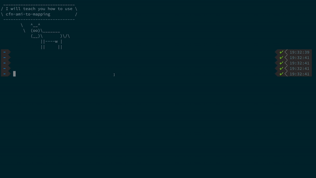

# Get AMI IDs per region automatically for your CloudFormation template

[](https://github.com/99stealth/cfn-ami-to-mapping/actions)


In most cases, people use the Mapping section in CloudFormation to associate AMI IDs with AWS regions as described in [THIS](https://docs.aws.amazon.com/AWSCloudFormation/latest/UserGuide/intrinsic-function-reference-findinmap.html) example.

I know how is it annoying to manually searching for AMI IDs in different AWS regions and build that map on your own, especially if your map is bigger than one image per region. That's why this tool had been created.

## How to install
### Install via `pip`
Ah, that's easy, just run next command
```
pip install cfn-ami-to-mapping
```
### Or you can build source code
Clone the repository
```
git clone https://github.com/99stealth/cfn-ami-to-mapping.git
```
- Run the command
```
make install
```

## How to use
### Long story short
I also know how it's annoying to read all this stuff. So, enjoy watching :eyes:


### Single image
#### The scenario
There is a requirement for only one image per region. 

Ok, all you need to specify it's AMI id and an AWS region where it locates.

```
cfn-ami-to-mapping --image-name ami-02f706d959cedf892 --top-level-key AMIID --region us-east-2
```
or instead of AMI id, you may specify the image name
```
cfn-ami-to-mapping --image-name amzn-ami-hvm-2018.03.0.20190611-x86_64-gp2 --top-level-key AMIID --region us-east-2
```
Wait several seconds and you will get your autogenerated block of mapping
```yaml
AMIRegionMap:
  ap-northeast-1:
    AMILinux: ami-04b2d1589ab1d972c
  ap-northeast-2:
    AMILinux: ami-0be3e6f84d3b968cd
  ap-south-1:
    AMILinux: ami-0b99c7725b9484f9e
  ap-southeast-1:
    AMILinux: ami-0fb6b6f9e81056553
  ap-southeast-2:
    AMILinux: ami-075caa3491def750b
  ca-central-1:
    AMILinux: ami-0a67d15f2858e33cb
  eu-central-1:
    AMILinux: ami-026d3b3672c6e7b66
  eu-north-1:
    AMILinux: ami-8c169ef2
  eu-west-1:
    AMILinux: ami-0862aabda3fb488b5
  eu-west-2:
    AMILinux: ami-0bdfa1adc3878cd23
  eu-west-3:
    AMILinux: ami-05b93cd5a1b552734
  sa-east-1:
    AMILinux: ami-0bb96001cf2299257
  us-east-1:
    AMILinux: ami-035b3c7efe6d061d5
  us-east-2:
    AMILinux: ami-02f706d959cedf892
  us-west-1:
    AMILinux: ami-0fcdcdb074d2bac5f
  us-west-2:
    AMILinux: ami-0f2176987ee50226e
```

### Several images
Ok, but there are cases when you should specify several images and  `Fn::FindInMap` them based on some input `Parameter` or maybe something else.
#### The scenario
You need to have possibility to swap your infrastructure from `Amazon Linux` to `Amazon Linux 2`.

Ok, then try to specify several values:
```
cfn-ami-to-mapping -i ami-035b3c7efe6d061d5 -k AMILinux -i ami-0b898040803850657 -k AMILinux2 --json
```
Here's what you'll get:
```yaml
AMIRegionMap:
  ap-northeast-1:
    AMILinux: ami-04b2d1589ab1d972c
    AMILinux2: ami-0c3fd0f5d33134a76
  ap-northeast-2:
    AMILinux: ami-0be3e6f84d3b968cd
    AMILinux2: ami-095ca789e0549777d
  ap-south-1:
    AMILinux: ami-0b99c7725b9484f9e
    AMILinux2: ami-0d2692b6acea72ee6
  ap-southeast-1:
    AMILinux: ami-0fb6b6f9e81056553
    AMILinux2: ami-01f7527546b557442
  ap-southeast-2:
    AMILinux: ami-075caa3491def750b
    AMILinux2: ami-0dc96254d5535925f
  ca-central-1:
    AMILinux: ami-0a67d15f2858e33cb
    AMILinux2: ami-0d4ae09ec9361d8ac
  eu-central-1:
    AMILinux: ami-026d3b3672c6e7b66
    AMILinux2: ami-0cc293023f983ed53
  eu-north-1:
    AMILinux: ami-8c169ef2
    AMILinux2: ami-3f36be41
  eu-west-1:
    AMILinux: ami-0862aabda3fb488b5
    AMILinux2: ami-0bbc25e23a7640b9b
  eu-west-2:
    AMILinux: ami-0bdfa1adc3878cd23
    AMILinux2: ami-0d8e27447ec2c8410
  eu-west-3:
    AMILinux: ami-05b93cd5a1b552734
    AMILinux2: ami-0adcddd3324248c4c
  sa-east-1:
    AMILinux: ami-0bb96001cf2299257
    AMILinux2: ami-058943e7d9b9cabfb
  us-east-1:
    AMILinux: ami-035b3c7efe6d061d5
    AMILinux2: ami-0b898040803850657
  us-east-2:
    AMILinux: ami-02f706d959cedf892
    AMILinux2: ami-0d8f6eb4f641ef691
  us-west-1:
    AMILinux: ami-0fcdcdb074d2bac5f
    AMILinux2: ami-056ee704806822732
  us-west-2:
    AMILinux: ami-0f2176987ee50226e
    AMILinux2: ami-082b5a644766e0e6f
```

#### :warning: Please, pay attention
- You may not specify a region, in this case, it will use default one which is `us-east-1`. Therefore you need to specify AMI ID of image from `us-east-1`.
- By default utility creates output using `yaml` format. If you want to change it to `json`, then run the utility with `--json` flag.
```
cfn-ami-to-mapping --image-id ami-02f706d959cedf892 --top-level-key AMIID --us-east-2 --json
```
And the output:
```json
{
    "AMIRegionMap": {
        "ap-northeast-1": {
            "AMILinux": "ami-04b2d1589ab1d972c"
        },
        "ap-northeast-2": {
            "AMILinux": "ami-0be3e6f84d3b968cd"
        },
        "ap-south-1": {
            "AMILinux": "ami-0b99c7725b9484f9e"
        },
        "ap-southeast-1": {
            "AMILinux": "ami-0fb6b6f9e81056553"
        },
        "ap-southeast-2": {
            "AMILinux": "ami-075caa3491def750b"
        },
        "ca-central-1": {
            "AMILinux": "ami-0a67d15f2858e33cb"
        },
        "eu-central-1": {
            "AMILinux": "ami-026d3b3672c6e7b66"
        },
        "eu-north-1": {
            "AMILinux": "ami-8c169ef2"
        },
        "eu-west-1": {
            "AMILinux": "ami-0862aabda3fb488b5"
        },
        "eu-west-2": {
            "AMILinux": "ami-0bdfa1adc3878cd23"
        },
        "eu-west-3": {
            "AMILinux": "ami-05b93cd5a1b552734"
        },
        "sa-east-1": {
            "AMILinux": "ami-0bb96001cf2299257"
        },
        "us-east-1": {
            "AMILinux": "ami-035b3c7efe6d061d5"
        },
        "us-east-2": {
            "AMILinux": "ami-02f706d959cedf892"
        },
        "us-west-1": {
            "AMILinux": "ami-0fcdcdb074d2bac5f"
        },
        "us-west-2": {
            "AMILinux": "ami-0f2176987ee50226e"
        }
    }
}
```

> :warning: It doesn't work perfectly, so please report `Issues` if you faced with any problem during the installation. 